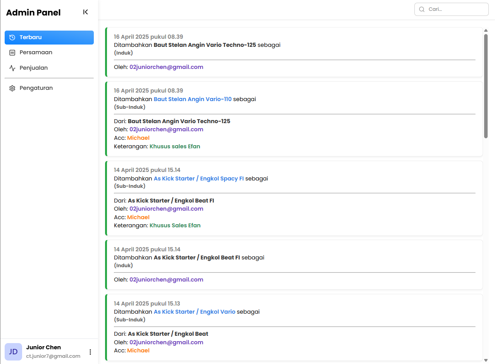
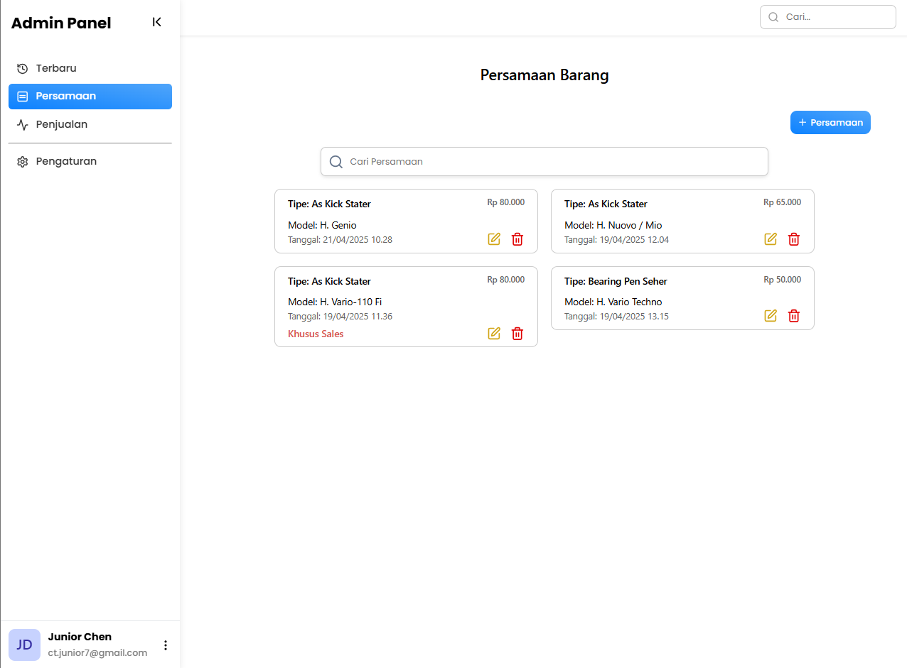
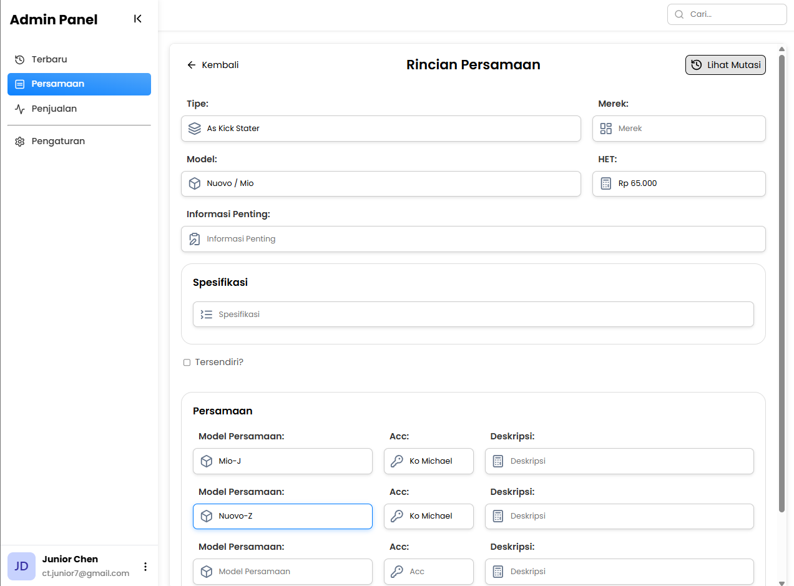
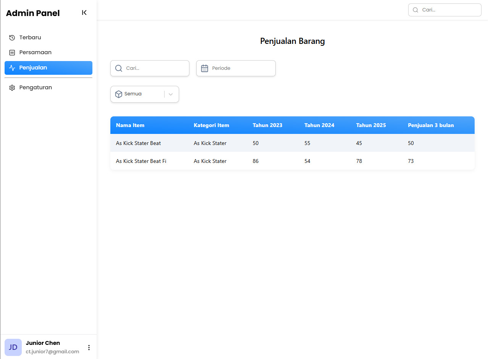

# ⚖️ Web Equality - RIKO Parts Internal System

<p align="left">
  
  
  
  
  
  
</p>

An integrated product equality management system designed specifically for **Web Equality** operations. This application simplifies the mapping of relationships between items (*item equality*), catalog management, and real-time activity monitoring through a modern interface.

---

## 🛠️ Tech Stack

**Frontend:**
- **Framework:** React.js (Vite)
- **Styling:** CSS V3
- **State Management:** React Context API
- **Search Engine:** **Algolia Search** (High-performance product discovery)
- **Iconography:** Lucide React

**Backend:**
- **Runtime:** Node.js & Express
- **Cloud Service:** **Firebase Services** (Real-time Data Handling)
- **Authentication:** Firebase Auth & Firebase Admin SDK
- **Search Integration:** Algolia API Synchronization

---

## 🔍 Key Features & Documentation

### 1. Operational Dashboard
A summary of system activities and product statistics presented in an informative visual format.
<p align="center">
  
</p>

### 2. Equality Products Management
The core feature to link products with equivalent specifications. Powered by **Algolia** to provide instant search results even with large product databases.
<p align="center">
  
</p>

### 3. Product Data Processing
An intuitive interface for managing equality data with a seamless user experience using glassmorphism components.
<p align="center">
  
  
</p>

### 4. Sales Analysis
Tracking related sales data to ensure accurate stock synchronization across departments.
<p align="center">
  
</p>

---

## ⚙️ Installation & Setup

### Prerequisites
- Node.js (Version 18 or higher)
- Firebase Project & Service Account Key
- Algolia Application ID & Admin API Key

### Getting Started

**1. Setup Backend:**
```bash
cd backend
npm install
node app.js
```

**1. Setup Frontend:**
```bash
cd frontend
npm install
npm run dev
